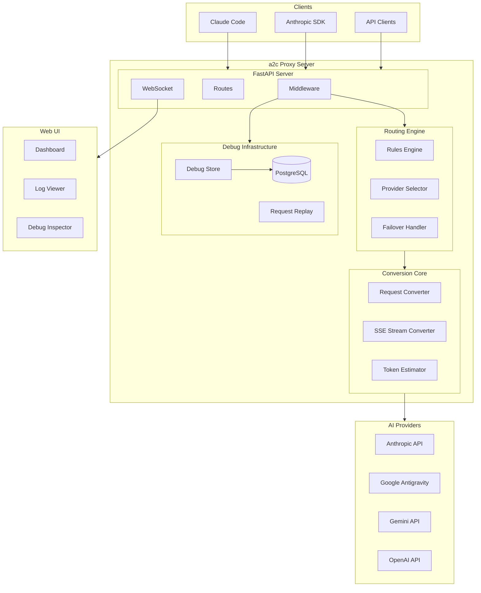
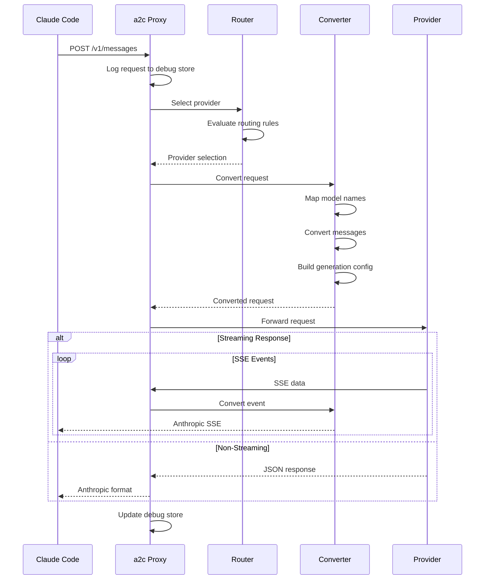
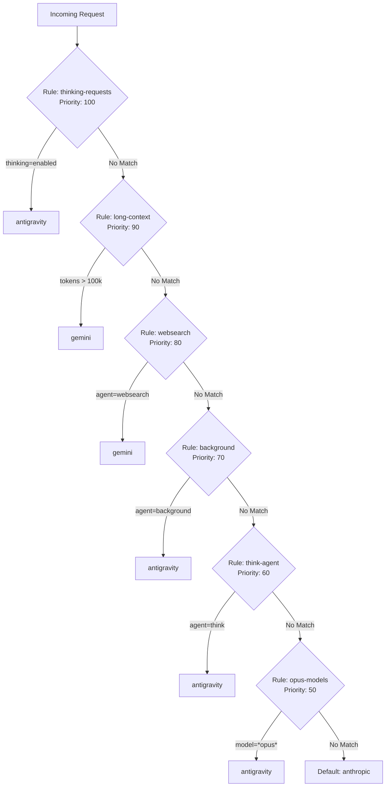
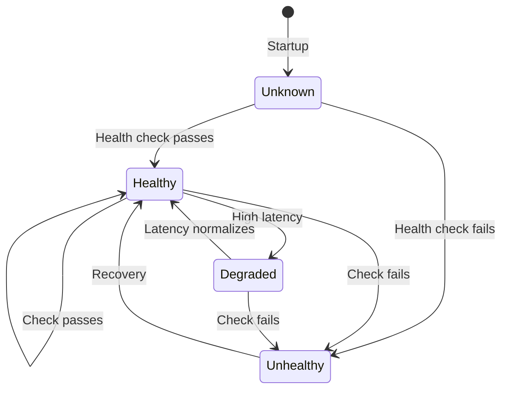
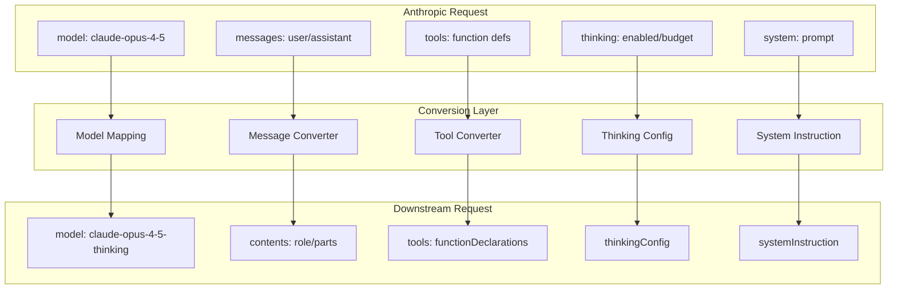
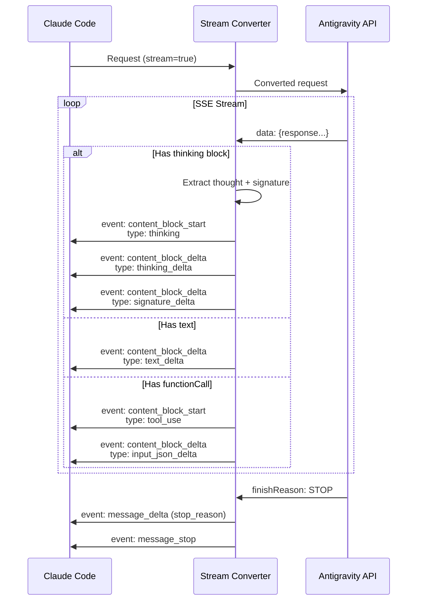
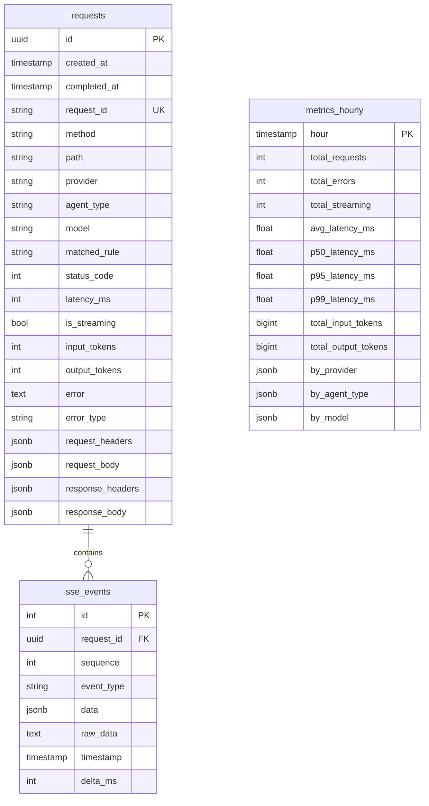
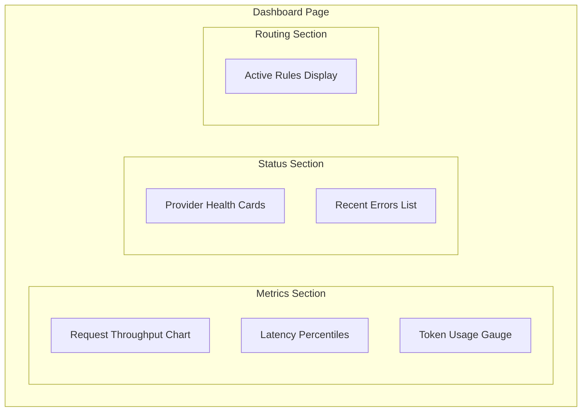

# a2c (antigravity2claudecode)

**AI API Router and Proxy** - Route requests to multiple AI providers with intelligent routing, debugging, and web UI.

[](https://www.python.org/downloads/)
[](https://opensource.org/licenses/MIT)
[](https://github.com/astral-sh/ruff)

---

## Table of Contents

- [Overview](#overview)
- [Key Features](#key-features)
- [Architecture](#architecture)
- [Quick Start](#quick-start)
- [Installation](#installation)
- [CLI Reference](#cli-reference)
- [API Reference](#api-reference)
- [Routing System](#routing-system)
- [Provider System](#provider-system)
- [Request Conversion](#request-conversion)
- [SSE Streaming](#sse-streaming)
- [Debug Infrastructure](#debug-infrastructure)
- [Web UI](#web-ui)
- [Configuration](#configuration)
- [Library Usage](#library-usage)
- [Testing](#testing)
- [Known Issues & Technical Debt](#known-issues--technical-debt)
- [Contributing](#contributing)
- [License](#license)

---

## Overview

**a2c** transforms from a simple conversion library into a full-featured AI API proxy/router that enables Claude Code and other Anthropic-compatible clients to work with multiple AI backends. It provides:

- **Multi-Provider Routing**: Intelligently route requests to Anthropic, Google Antigravity, Gemini, or OpenAI based on configurable rules
- **Extended Thinking Support**: Full support for Claude Opus 4.5 thinking blocks with signature handling
- **SSE Stream Conversion**: Real-time conversion between API formats with token usage tracking
- **Enterprise Debugging**: PostgreSQL-backed request storage, SSE recording, and request replay
- **CLI Tools**: Rich TUI dashboard, Claude Code integration, configuration management
- **Web UI Dashboard**: React-based dashboard for monitoring, routing, and debugging

---

## Key Features

| Feature                    | Description                                                                          |
| -------------------------- | ------------------------------------------------------------------------------------ |
| **Multi-Provider Support** | Route to Anthropic, Antigravity (Google), Gemini, OpenAI with automatic failover     |
| **Intelligent Routing**    | Rule-based routing by agent type, model pattern, thinking config, context size       |
| **Extended Thinking**      | Native support for thinking blocks with signature replay for conversation continuity |
| **SSE Streaming**          | Real-time stream conversion with token usage extraction and error handling           |
| **Debug Storage**          | PostgreSQL storage for full request/response debugging and replay                    |
| **CLI Tools**              | 8 CLI commands including TUI dashboard and Claude Code launcher                      |
| **Web Dashboard**          | React + shadcn/ui dashboard with real-time metrics and routing visualization         |
| **Tool Use Support**       | Function calling conversion between Anthropic and Gemini formats                     |
| **Vision Support**         | Image handling with base64 encoding conversion                                       |

---

## Architecture

### System Overview



### Request Flow



### Directory Structure

```
a2c/
├── src/
│   └── a2c/
│       ├── __init__.py                 # Package exports, version info
│       ├── core/                       # Core conversion library
│       │   ├── converter.py            # Request conversion logic
│       │   ├── streaming.py            # SSE stream conversion
│       │   ├── token_estimator.py      # Token count estimation
│       │   └── helpers.py              # Utility functions
│       │
│       ├── server/                     # FastAPI server
│       │   ├── app.py                  # App factory, lifespan
│       │   ├── config.py               # Pydantic settings
│       │   ├── middleware/             # Request/response middleware
│       │   │   └── logging.py          # Debug logging middleware
│       │   ├── routes/                 # API route handlers
│       │   │   ├── anthropic.py        # /v1/messages endpoint
│       │   │   ├── admin.py            # /admin/* endpoints
│       │   │   ├── debug.py            # /debug/* endpoints
│       │   │   └── health.py           # /health/* endpoints
│       │   └── websocket/              # WebSocket handlers
│       │       └── __init__.py         # Status & log streaming
│       │
│       ├── router/                     # Routing system
│       │   ├── rules.py                # Routing rules engine
│       │   ├── failover.py             # Failover handling
│       │   └── config.py               # Router configuration
│       │
│       ├── providers/                  # Provider implementations
│       │   ├── base.py                 # Abstract provider interface
│       │   ├── registry.py             # Provider registry
│       │   ├── anthropic.py            # Anthropic provider
│       │   ├── antigravity.py          # Google Antigravity provider
│       │   ├── gemini.py               # Gemini provider
│       │   └── openai.py               # OpenAI provider
│       │
│       ├── debug/                      # Debug infrastructure
│       │   ├── models.py               # SQLAlchemy models
│       │   ├── database.py             # Database connection
│       │   └── store.py                # Debug data operations
│       │
│       └── cli/                        # CLI tools
│           └── main.py                 # Typer CLI commands
│
├── ui/                                 # React web dashboard
│   ├── src/
│   │   ├── App.tsx                     # Router setup
│   │   ├── components/                 # UI components
│   │   │   ├── ui/                     # shadcn/ui components
│   │   │   ├── Layout.tsx              # App layout
│   │   │   └── ErrorBoundary.tsx       # Error handling
│   │   ├── pages/                      # Page components
│   │   │   ├── Dashboard.tsx           # Main dashboard
│   │   │   ├── Providers.tsx           # Provider management
│   │   │   ├── Routing.tsx             # Routing rules
│   │   │   ├── Logs.tsx                # Log viewer
│   │   │   ├── Debug.tsx               # Request inspector
│   │   │   └── Settings.tsx            # Configuration
│   │   ├── hooks/                      # Custom React hooks
│   │   │   └── useWebSocket.ts         # WebSocket connection
│   │   └── lib/                        # Utilities
│   │       └── api.ts                  # API client
│   └── e2e/                            # Playwright E2E tests
│
├── tests/                              # Python test suite
│   ├── unit/                           # Unit tests
│   └── integration/                    # Integration tests
│
├── config/                             # Configuration templates
├── pyproject.toml                      # Python package config
├── alembic.ini                         # Database migrations
└── README.md                           # This file
```

---

## Quick Start

### 1. Install a2c

```bash
# Install from source using Poetry
git clone https://github.com/nikketryhard/antigravity2claudecode
cd antigravity2claudecode
poetry install
```

### 2. Configure Environment

```bash
# Required: At least one provider API key
export ANTHROPIC_API_KEY=sk-ant-...
export GOOGLE_API_KEY=...

# Optional: Database for debug storage
export A2C_DATABASE_URL=postgresql://localhost/a2c
```

### 3. Start the Server

```bash
# Start with default settings
a2c serve

# Start with hot reload for development
a2c serve --reload --log-level DEBUG
```

### 4. Launch Claude Code

```bash
# Launch Claude Code using a2c as proxy
a2c code

# Or manually configure Claude Code
export ANTHROPIC_BASE_URL=http://localhost:8080
claude
```

### 5. Access the Dashboard

Open http://localhost:8080 in your browser to access the web dashboard.

---

## Installation

### Requirements

- **Python**: 3.10 or higher
- **Poetry**: 1.0 or higher
- **PostgreSQL**: 14+ (optional, for debug storage)
- **Node.js**: 18+ (for UI development only)

### From Source

```bash
# Clone the repository
git clone https://github.com/nikketryhard/antigravity2claudecode
cd antigravity2claudecode

# Install dependencies with Poetry
poetry install

# Activate the virtual environment
poetry shell

# Verify installation
a2c version
```

### Database Setup (Optional)

```bash
# Create PostgreSQL database
createdb a2c

# Set connection URL
export A2C_DATABASE_URL=postgresql://localhost/a2c

# Run migrations (if using Alembic)
alembic upgrade head
```

### UI Development Setup

```bash
cd ui

# Install dependencies
npm install

# Start development server
npm run dev

# Run E2E tests
npm run test:e2e
```

---

## CLI Reference

The `a2c` CLI provides 8 commands for server management, debugging, and Claude Code integration.

### `a2c serve`

Start the proxy server.

```bash
a2c serve [OPTIONS]
```

| Option            | Default     | Description                             |
| ----------------- | ----------- | --------------------------------------- |
| `--host, -h`      | `127.0.0.1` | Bind host address                       |
| `--port, -p`      | `8080`      | Bind port                               |
| `--reload, -r`    | `false`     | Enable hot reload (development)         |
| `--log-level, -l` | `INFO`      | Log level (DEBUG, INFO, WARNING, ERROR) |

**Examples:**

```bash
# Production mode
a2c serve --host 0.0.0.0 --port 8080

# Development mode with verbose logging
a2c serve --reload --log-level DEBUG
```

---

### `a2c code`

Launch Claude Code with a2c as the proxy.

```bash
a2c code [OPTIONS]
```

| Option                     | Default       | Description              |
| -------------------------- | ------------- | ------------------------ |
| `--provider, -p`           | `antigravity` | Provider to use          |
| `--model, -m`              | -             | Specific model to use    |
| `--thinking/--no-thinking` | `true`        | Enable extended thinking |

**Examples:**

```bash
# Default: Use antigravity with thinking enabled
a2c code

# Use specific model
a2c code --model claude-opus-4-5

# Disable thinking
a2c code --no-thinking
```

---

### `a2c status`

Show server status dashboard using Rich TUI.

```bash
a2c status [OPTIONS]
```

| Option           | Default | Description                |
| ---------------- | ------- | -------------------------- |
| `--live, -l`     | `false` | Enable live updates        |
| `--interval, -i` | `2.0`   | Update interval in seconds |

**Examples:**

```bash
# Static snapshot
a2c status

# Live dashboard with 1-second updates
a2c status --live --interval 1
```

**Dashboard Panels:**

- **Providers**: Status, latency, capabilities
- **Routing**: Default and specialized providers
- **Stats**: Request counts, error rates, token usage
- **Recent Requests**: Last 5 requests with status

---

### `a2c config`

Manage configuration.

```bash
a2c config <ACTION>
```

| Action | Description                           |
| ------ | ------------------------------------- |
| `show` | Display current configuration as JSON |
| `init` | Create default `config.yaml` file     |
| `path` | Show config file path                 |

**Examples:**

```bash
# View current config
a2c config show

# Create config.yaml
a2c config init
```

---

### `a2c route`

Manage routing rules.

```bash
a2c route <ACTION> [OPTIONS]
```

| Action | Description                                  |
| ------ | -------------------------------------------- |
| `list` | Show all routing rules                       |
| `show` | Show specific rule details                   |
| `test` | Test provider selection for given conditions |

| Option        | Description                  |
| ------------- | ---------------------------- |
| `--name, -n`  | Rule name (for show action)  |
| `--agent, -a` | Agent type (for test action) |
| `--model, -m` | Model name (for test action) |

**Examples:**

```bash
# List all rules
a2c route list

# Test routing for thinking agent
a2c route test --agent think --model claude-opus-4-5
```

---

### `a2c provider`

Manage providers.

```bash
a2c provider <ACTION> [OPTIONS]
```

| Action   | Description                    |
| -------- | ------------------------------ |
| `list`   | List all providers with status |
| `show`   | Show provider details          |
| `health` | Check all provider health      |

| Option       | Description   |
| ------------ | ------------- |
| `--name, -n` | Provider name |

**Examples:**

```bash
# List providers
a2c provider list

# Check health
a2c provider health
```

---

### `a2c logs`

View server logs and request history.

```bash
a2c logs <ACTION> [OPTIONS]
```

| Action | Description               |
| ------ | ------------------------- |
| `tail` | Show recent log entries   |
| `show` | Show logs in table format |

| Option         | Default | Description       |
| -------------- | ------- | ----------------- |
| `--lines, -n`  | `50`    | Number of entries |
| `--follow, -f` | `false` | Follow log output |
| `--level, -l`  | `INFO`  | Minimum log level |

**Examples:**

```bash
# Tail recent logs
a2c logs tail --lines 20

# Follow logs in real-time
a2c logs tail --follow
```

---

### `a2c debug`

Debug stored requests.

```bash
a2c debug <ACTION> [OPTIONS]
```

| Action    | Description               |
| --------- | ------------------------- |
| `list`    | List stored requests      |
| `show`    | Show full request details |
| `stats`   | Show statistics           |
| `cleanup` | Remove old requests       |

| Option        | Default | Description            |
| ------------- | ------- | ---------------------- |
| `--id, -i`    | -       | Request ID (for show)  |
| `--limit, -n` | `20`    | Number of items        |
| `--hours`     | `24`    | Hours for stats period |

**Examples:**

```bash
# List recent requests
a2c debug list --limit 10

# Show request details
a2c debug show --id req_abc123

# View 24-hour stats
a2c debug stats --hours 24

# Cleanup old data
a2c debug cleanup
```

---

## API Reference

### Base URL

```
http://localhost:8080
```

### Proxy Endpoints

#### `POST /v1/messages`

Anthropic Messages API proxy endpoint. Requests are routed to configured providers based on routing rules.

**Request Headers:**
| Header | Description |
|--------|-------------|
| `x-api-key` | API key (optional, uses configured key) |
| `x-agent-type` | Agent type for routing (`default`, `background`, `think`, etc.) |
| `anthropic-version` | API version |

**Request Body:** Standard Anthropic Messages API format.

**Response:** Anthropic Messages API format (streaming or non-streaming).

---

#### `GET /v1/models`

List available models across all configured providers.

**Response:**

```json
{
  "object": "list",
  "data": [
    {
      "id": "claude-sonnet-4-5",
      "object": "model",
      "provider": "antigravity"
    }
  ]
}
```

---

### Health Endpoints

#### `GET /health`

Basic health check.

**Response:**

```json
{
  "status": "healthy",
  "version": "0.1.0",
  "providers": {
    "total": 2,
    "healthy": 2,
    "degraded": 0,
    "unhealthy": 0
  }
}
```

---

#### `GET /health/providers`

Detailed provider status.

**Response:**

```json
{
  "providers": {
    "anthropic": {
      "configured": true,
      "enabled": true,
      "health": {
        "status": "healthy",
        "latency_ms": 150,
        "last_check": "2024-01-01T12:00:00Z"
      },
      "capabilities": {
        "streaming": true,
        "thinking": false,
        "tools": true,
        "vision": true
      }
    },
    "antigravity": {
      "configured": true,
      "enabled": true,
      "health": {
        "status": "healthy",
        "latency_ms": 200
      },
      "capabilities": {
        "streaming": true,
        "thinking": true,
        "tools": true,
        "vision": true
      }
    }
  },
  "total": 2,
  "healthy": 2
}
```

---

### Admin Endpoints

#### `GET /admin/config`

Get current server configuration.

---

#### `GET /admin/routing/rules`

Get routing rules.

**Response:**

```json
{
  "default_provider": "anthropic",
  "rules": [
    {
      "name": "thinking-requests",
      "priority": 100,
      "provider": "antigravity",
      "conditions": {
        "thinking_enabled": true
      }
    }
  ],
  "total_rules": 6
}
```

---

#### `GET /admin/routing/test`

Test routing selection.

**Query Parameters:**
| Parameter | Description |
|-----------|-------------|
| `model` | Model name to test |
| `agent_type` | Agent type to test |
| `context_tokens` | Estimated context tokens |

**Response:**

```json
{
  "provider": "antigravity",
  "matched_rule": "thinking-requests"
}
```

---

### Debug Endpoints

#### `GET /debug/requests`

List stored requests.

**Query Parameters:**
| Parameter | Default | Description |
|-----------|---------|-------------|
| `limit` | `20` | Maximum items |
| `offset` | `0` | Pagination offset |
| `provider` | - | Filter by provider |
| `status_code` | - | Filter by status |

**Response:**

```json
{
  "items": [
    {
      "id": "uuid",
      "request_id": "req_abc123",
      "created_at": "2024-01-01T12:00:00Z",
      "provider": "antigravity",
      "model": "claude-sonnet-4-5",
      "status_code": 200,
      "latency_ms": 1500,
      "input_tokens": 100,
      "output_tokens": 500
    }
  ],
  "total": 100,
  "has_more": true
}
```

---

#### `GET /debug/requests/{id}`

Get full request details including body and headers.

---

#### `POST /debug/requests/{id}/replay`

Replay a stored request.

---

#### `GET /debug/stats`

Get statistics for a time period.

**Query Parameters:**
| Parameter | Default | Description |
|-----------|---------|-------------|
| `hours` | `24` | Time period in hours |

**Response:**

```json
{
  "period_hours": 24,
  "total_requests": 1000,
  "total_errors": 5,
  "error_rate": 0.005,
  "avg_latency_ms": 1200,
  "total_input_tokens": 50000,
  "total_output_tokens": 200000,
  "by_provider": {
    "antigravity": 800,
    "anthropic": 200
  }
}
```

---

#### `DELETE /debug/cleanup`

Cleanup old debug data based on retention policy.

---

### WebSocket Endpoints

#### `WS /ws/status`

Real-time status updates.

**Message Format:**

```json
{
  "type": "status_update",
  "data": {
    "providers": {...},
    "stats": {...}
  }
}
```

---

#### `WS /ws/logs`

Real-time log streaming.

**Message Format:**

```json
{
  "type": "log",
  "data": {
    "request_id": "req_abc123",
    "provider": "antigravity",
    "status_code": 200,
    "latency_ms": 1500
  }
}
```

---

## Routing System

The routing system determines which provider handles each request based on configurable rules evaluated by priority.

### Agent Types

| Agent Type     | Description                  | Default Provider |
| -------------- | ---------------------------- | ---------------- |
| `default`      | Standard requests            | Anthropic        |
| `background`   | Background/async tasks       | Antigravity      |
| `think`        | Extended thinking (Opus)     | Antigravity      |
| `long_context` | Requests > context threshold | Gemini           |
| `websearch`    | Web search enabled           | Gemini           |
| `code`         | Code generation tasks        | Antigravity      |

### Routing Rules

Rules are evaluated in priority order (highest first). First matching rule determines the provider.



### Default Rules Configuration

```yaml
routing:
  default_provider: anthropic
  long_context_threshold: 100000

  rules:
    - name: thinking-requests
      priority: 100
      provider: antigravity
      match:
        thinking_enabled: true

    - name: long-context
      priority: 90
      provider: gemini
      match:
        min_context_tokens: 100000

    - name: websearch
      priority: 80
      provider: gemini
      match:
        agent_type: websearch

    - name: background
      priority: 70
      provider: antigravity
      match:
        agent_type: background

    - name: think-agent
      priority: 60
      provider: antigravity
      match:
        agent_type: think

    - name: opus-models
      priority: 50
      provider: antigravity
      match:
        model_pattern: ".*opus.*"
```

### Rule Matching Conditions

| Condition            | Description                          |
| -------------------- | ------------------------------------ |
| `agent_type`         | Match specific agent type header     |
| `model_pattern`      | Regex pattern for model name         |
| `thinking_enabled`   | Match requests with thinking enabled |
| `min_context_tokens` | Minimum estimated context tokens     |
| `max_context_tokens` | Maximum estimated context tokens     |

---

## Provider System

### Provider Interface

All providers implement the `BaseProvider` abstract class:

```python
class BaseProvider(ABC):
    """Abstract base class for all AI providers."""

    @property
    @abstractmethod
    def info(self) -> ProviderInfo:
        """Get provider metadata."""
        ...

    @abstractmethod
    async def send_request(
        self,
        request: dict[str, Any],
        *,
        stream: bool = False,
        timeout: float = 120.0,
    ) -> ProviderResponse:
        """Send a request to the provider."""
        ...

    @abstractmethod
    async def stream_response(
        self,
        request: dict[str, Any],
        *,
        timeout: float = 120.0,
    ) -> AsyncIterator[bytes]:
        """Stream a response from the provider."""
        ...

    @abstractmethod
    async def health_check(self) -> ProviderHealth:
        """Check provider health."""
        ...
```

### Built-in Providers

| Provider        | API Format | Thinking | Streaming | Max Context |
| --------------- | ---------- | -------- | --------- | ----------- |
| **Anthropic**   | Anthropic  | No       | Yes       | 200K        |
| **Antigravity** | Gemini     | Yes      | Yes       | 200K        |
| **Gemini**      | Gemini     | No       | Yes       | 1M          |
| **OpenAI**      | OpenAI     | No       | Yes       | 128K        |

### Provider Health Status



| Status      | Description                    |
| ----------- | ------------------------------ |
| `healthy`   | Provider responding normally   |
| `degraded`  | High latency or partial issues |
| `unhealthy` | Provider not responding        |
| `unknown`   | Not yet checked                |

---

## Request Conversion

### Model Mapping

Claude model names are mapped to downstream provider model names:

| Claude Model               | Mapped Model               |
| -------------------------- | -------------------------- |
| `claude-opus-4-5`          | `claude-opus-4-5-thinking` |
| `claude-sonnet-4-5`        | `claude-sonnet-4-5`        |
| `claude-haiku-4-5`         | `gemini-2.5-flash`         |
| `claude-opus-4-5-20251101` | `claude-opus-4-5-thinking` |
| `claude-3-5-sonnet-*`      | `claude-sonnet-4-5`        |

### Message Conversion Flow



### Content Block Types

| Anthropic Type | Converted To                                                  |
| -------------- | ------------------------------------------------------------- |
| `text`         | `{"text": "..."}`                                             |
| `image`        | `{"inlineData": {...}}`                                       |
| `tool_use`     | `{"functionCall": {...}}`                                     |
| `tool_result`  | `{"functionResponse": {...}}`                                 |
| `thinking`     | `{"text": "...", "thought": true, "thoughtSignature": "..."}` |

### Thinking Configuration

```python
# Various input formats supported:
get_thinking_config(None)
# -> {"includeThoughts": True, "thinkingBudget": 1024}

get_thinking_config(True)
# -> {"includeThoughts": True, "thinkingBudget": 1024}

get_thinking_config(False)
# -> {"includeThoughts": False}

get_thinking_config({"type": "enabled", "budget_tokens": 5000})
# -> {"includeThoughts": True, "thinkingBudget": 5000}
```

---

## SSE Streaming

### Stream Conversion Flow



### Event Types

| Anthropic Event       | Description                           |
| --------------------- | ------------------------------------- |
| `message_start`       | Initial message with usage info       |
| `content_block_start` | Start of text/thinking/tool_use block |
| `content_block_delta` | Incremental content update            |
| `content_block_stop`  | End of content block                  |
| `message_delta`       | Final usage and stop reason           |
| `message_stop`        | Stream complete                       |

### Delta Types

| Delta Type         | Description                |
| ------------------ | -------------------------- |
| `text_delta`       | Text content increment     |
| `thinking_delta`   | Thinking content increment |
| `signature_delta`  | Thinking signature         |
| `input_json_delta` | Tool input JSON            |

### Thinking to Text Conversion

When `client_thinking_enabled=False` and `thinking_to_text=True`, thinking content is wrapped in XML tags:

```
<assistant_thinking>
[thinking content here]
</assistant_thinking>

[regular response text]
```

This preserves context for clients that don't support native thinking blocks.

---

## Debug Infrastructure

### Database Schema



### Indexes

| Index                           | Purpose               |
| ------------------------------- | --------------------- |
| `idx_requests_created_desc`     | Recent requests query |
| `idx_requests_provider_created` | Filter by provider    |
| `idx_requests_status_created`   | Filter by status      |
| `idx_sse_request_seq`           | SSE event ordering    |

### Request Storage

- Full request/response headers and bodies stored as JSONB
- SSE events stored with sequence numbers for replay
- Token usage tracked for billing/monitoring
- Error information captured for debugging

### Request Replay

Stored requests can be replayed to:

- Debug issues with specific requests
- Test provider behavior changes
- Compare responses across providers

---

## Web UI

### Pages

| Page          | Description                                               |
| ------------- | --------------------------------------------------------- |
| **Dashboard** | Real-time metrics, charts, provider status, recent errors |
| **Providers** | Provider list, health status, capabilities, configuration |
| **Routing**   | Visual routing rules, priority ordering, rule testing     |
| **Logs**      | Searchable log viewer, filters, live tail mode            |
| **Debug**     | Request inspector, full request/response view, SSE replay |
| **Settings**  | Server configuration, log levels, UI preferences          |

### Dashboard Components



### Technology Stack

| Component     | Technology           |
| ------------- | -------------------- |
| Framework     | React 19             |
| Build Tool    | Vite 7               |
| Language      | TypeScript           |
| Styling       | TailwindCSS 4        |
| UI Components | shadcn/ui + Radix UI |
| Charts        | Recharts             |
| Animations    | Framer Motion        |
| Routing       | React Router DOM 7   |
| Notifications | Sonner               |
| Icons         | Lucide React         |
| Testing       | Vitest + Playwright  |

---

## Configuration

### YAML Configuration

Create `config.yaml` with `a2c config init`:

```yaml
# a2c Configuration
server:
  host: 127.0.0.1
  port: 8080
  log_level: INFO
  debug_enabled: true

database:
  enabled: true
  url: postgresql://localhost/a2c
  retention_days: 7

routing:
  long_context_threshold: 100000
  default_provider: anthropic
  background_provider: antigravity
  think_provider: antigravity
  long_context_provider: gemini
  websearch_provider: gemini

providers:
  anthropic:
    enabled: true
    # API key from ANTHROPIC_API_KEY env var

  antigravity:
    enabled: true
    # API key from GOOGLE_API_KEY env var

  gemini:
    enabled: true
    # API key from GOOGLE_API_KEY env var

  openai:
    enabled: false
    # API key from OPENAI_API_KEY env var
```

### Environment Variables

| Variable                   | Default         | Description                  |
| -------------------------- | --------------- | ---------------------------- |
| **Server**                 |
| `A2C_HOST`                 | `127.0.0.1`     | Server bind host             |
| `A2C_PORT`                 | `8080`          | Server bind port             |
| `A2C_LOG_LEVEL`            | `INFO`          | Log level                    |
| `A2C_CONFIG_PATH`          | `./config.yaml` | Config file path             |
| **Database**               |
| `A2C_DATABASE_URL`         | -               | PostgreSQL connection URL    |
| `A2C_DEBUG_RETENTION_DAYS` | `7`             | Debug data retention         |
| **Providers**              |
| `ANTHROPIC_API_KEY`        | -               | Anthropic API key            |
| `GOOGLE_API_KEY`           | -               | Google/Gemini API key        |
| `OPENAI_API_KEY`           | -               | OpenAI API key               |
| **Debug**                  |
| `ANTHROPIC_DEBUG`          | -               | Enable verbose debug logging |

---

## Library Usage

For programmatic use without the server:

### Request Conversion

```python
from a2c.core import convert_anthropic_request_to_antigravity_components

# Anthropic Messages API request
anthropic_request = {
    "model": "claude-opus-4-5",
    "max_tokens": 4096,
    "thinking": {"type": "enabled", "budget_tokens": 10000},
    "messages": [
        {"role": "user", "content": "Explain quantum computing"}
    ]
}

# Convert to downstream format
components = convert_anthropic_request_to_antigravity_components(anthropic_request)

# components contains:
# - model: "claude-opus-4-5-thinking"
# - contents: [{"role": "user", "parts": [{"text": "..."}]}]
# - generation_config: {"thinkingConfig": {...}, ...}
# - system_instruction: Optional
# - tools: Optional
```

### Streaming Conversion

```python
from a2c.core import antigravity_sse_to_anthropic_sse

async def convert_stream(antigravity_lines):
    async for event in antigravity_sse_to_anthropic_sse(
        antigravity_lines,
        model="claude-opus-4-5",
        message_id="msg_123",
        client_thinking_enabled=True,
        thinking_to_text=False,
    ):
        yield event  # Anthropic SSE format bytes
```

### Converter Functions

| Function                                                | Description                             |
| ------------------------------------------------------- | --------------------------------------- |
| `convert_anthropic_request_to_antigravity_components()` | Full request conversion                 |
| `convert_messages_to_contents()`                        | Message format conversion               |
| `convert_tools()`                                       | Tool/function declaration conversion    |
| `build_system_instruction()`                            | System prompt conversion                |
| `build_generation_config()`                             | Generation parameters + thinking config |
| `map_claude_model_to_gemini()`                          | Model name mapping                      |
| `get_thinking_config()`                                 | Thinking configuration builder          |
| `clean_json_schema()`                                   | JSON Schema cleanup for downstream      |

### Helper Functions

| Function                        | Description                        |
| ------------------------------- | ---------------------------------- |
| `anthropic_debug_enabled()`     | Check if ANTHROPIC_DEBUG is set    |
| `remove_nulls_for_tool_input()` | Clean null values from tool inputs |
| `estimate_input_tokens()`       | Rough token count estimation       |

---

## Testing

### Python Tests

```bash
# Install dependencies (includes dev dependencies)
poetry install

# Run all tests
poetry run pytest tests/ -v

# Run with coverage
poetry run pytest tests/ --cov=a2c --cov-report=term-missing

# Run specific test file
poetry run pytest tests/unit/test_converter.py -v

# Run with debug output
poetry run pytest tests/ -v --tb=long
```

### Test Structure

```
tests/
├── unit/
│   ├── test_converter.py       # Request conversion
│   ├── test_streaming.py       # SSE conversion
│   ├── test_providers.py       # Provider implementations
│   ├── test_router.py          # Routing rules
│   ├── test_config.py          # Configuration
│   └── test_failover.py        # Failover logic
├── integration/
│   ├── test_server.py          # API endpoints
│   └── test_routing.py         # Full routing flow
└── conftest.py                 # Fixtures
```

### UI Tests

```bash
cd ui

# Unit tests
npm run test

# Watch mode
npm run test:watch

# Coverage
npm run test:coverage

# E2E tests
npm run test:e2e

# E2E with UI
npm run test:e2e:ui

# Type checking
npm run typecheck
```

---

## Known Issues & Technical Debt

### High Priority

#### 1. E2E Tests Use API Mocking

**Component:** UI / Testing
**File:** `ui/e2e/fixtures.ts`

The Playwright E2E tests mock all API responses. While this allows tests to run without a backend:

- Tests won't catch actual API integration issues
- Mock data structure might drift from the real API
- Changes to API response format won't be caught

**Recommended Fix:**

- Create separate integration test suite with real backend
- Add API contract tests using OpenAPI validation
- Run E2E tests in CI with Docker backend

---

#### 2. Unused Error State Removed Instead of Displayed

**Component:** UI
**Files:** `ui/src/pages/Providers.tsx`, `ui/src/pages/Dashboard.tsx`

Error state was removed to fix ESLint warnings, but errors should be displayed to users when API calls fail.

**Recommended Fix:**

```tsx
const [error, setError] = useState<string | null>(null);

{
  error && (
    <Alert variant="destructive">
      <AlertTitle>Error</AlertTitle>
      <AlertDescription>{error}</AlertDescription>
    </Alert>
  );
}
```

---

#### 3. WebSocket Mock Missing in E2E Tests

**Component:** UI / Testing
**File:** `ui/e2e/fixtures.ts`

E2E test fixtures mock HTTP requests but not WebSocket connections. Real-time update functionality is not tested.

**Recommended Fix:**
Add WebSocket mocking or use `playwright-websocket-mock`.

---

### Medium Priority

#### 4. Visual Regression Tests Are Fragile

Screenshot-based visual regression tests fail on different OS/font rendering.

**Recommended Fix:**

- Add `threshold` option to `toHaveScreenshot()` calls
- Use visual testing service like Percy or Chromatic

---

#### 5. Tooltip Test Always Passes (No-Op Test)

**File:** `ui/e2e/dashboard.spec.ts:196-208`

Test uses `expect(tooltipCount).toBeGreaterThanOrEqual(0)` which always passes.

---

#### 6. `waitForTimeout` Usage in Tests

Several tests use `waitForTimeout` which is discouraged - replace with proper wait conditions.

---

#### 7. No Test for Request Replay Functionality

Debug page replay button has no E2E test coverage.

---

### Technical Debt

#### TD-1: Inconsistent Error Handling Across Pages

Different pages handle errors differently (toast, console, state, nothing).

**Recommendation:** Create consistent error handling pattern with `useApiError` hook.

---

#### TD-2: API Client Could Use React Query

Current API client is a simple fetch wrapper. Consider adopting TanStack Query for:

- Automatic caching
- Background refetching
- Optimistic updates
- Devtools

---

#### TD-3: WebSocket Hook Complexity

**File:** `ui/src/hooks/useWebSocket.ts`

Complex reconnection logic with refs. Consider using `react-use-websocket` or state machine pattern.

---

### Future Enhancements

| ID   | Enhancement                                    |
| ---- | ---------------------------------------------- |
| FE-1 | Add integration test suite with Docker backend |
| FE-2 | Add API contract tests with OpenAPI validation |
| FE-3 | Add accessibility testing with axe-core        |
| FE-4 | Add performance testing with Lighthouse CI     |
| FE-5 | Implement request replay UI button             |
| FE-6 | Add dark mode persistence to localStorage      |

---

## Contributing

### Development Setup

```bash
# Clone repository
git clone https://github.com/nikketryhard/antigravity2claudecode
cd antigravity2claudecode

# Install dependencies with Poetry
poetry install

# Activate the virtual environment
poetry shell

# Install pre-commit hooks
poetry run pre-commit install
```

### Code Style

- **Python:** Ruff for linting/formatting, mypy for type checking
- **TypeScript:** ESLint, Prettier
- **Commits:** Conventional Commits (`feat:`, `fix:`, `refactor:`)

### Pull Request Process

1. Create feature branch: `feat/description` or `fix/issue-number-description`
2. Write tests for new functionality
3. Ensure all tests pass: `poetry run pytest tests/` and `npm run test`
4. Update documentation if needed
5. Submit PR with clear description

### Issue Tracking

When fixing issues from Known Issues section:

1. Reference the issue in your PR
2. Update this document to mark issue as resolved
3. Add tests to prevent regression

---

## License

MIT License - See [LICENSE](LICENSE) for details.

---

## Related Projects

- [gcli2api](https://github.com/su-kaka/gcli2api) - Full proxy server with credential management
- [Claude Code](https://claude.com/claude-code) - Anthropic's official CLI tool

---

## Credits

**Author:** Louis (nikketryhard)
**Email:** louisnewmobile@gmail.com

---

_Generated with comprehensive analysis of the codebase, combining PLAN.md architectural documentation and KNOWN_ISSUES.md technical debt tracking._
